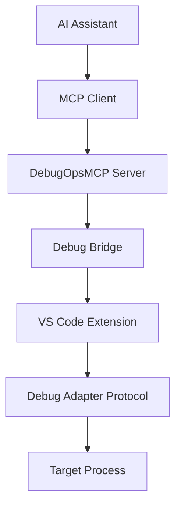

# DebugOpsMCP

## Overview

DebugOpsMCP is a Model Context Protocol (MCP) server that enables AI assistants to interact with debugging tools and inspect running processes. It provides a comprehensive debugging interface through VS Code integration and supports both local and remote debugging scenarios.

## Features

- **🔧 Comprehensive Debug Operations**: Attach/detach, breakpoints, execution control, variable inspection
- **🤖 AI Assistant Integration**: Native support for AI-driven debugging workflows
- **🔌 VS Code Extension**: Seamless integration with Visual Studio Code debugger
- **🔄 Real-time Communication**: Bidirectional JSON-RPC protocol over stdio
- **🛡️ Robust Error Handling**: Custom exception hierarchy with retry mechanisms
- **🎯 Automatic Discovery**: Multiple fallback paths for server detection
- **📊 Performance Monitoring**: Built-in profiling and analysis tools

## Quick Start

### Prerequisites

- .NET 8.0 or later
- Visual Studio Code
- Node.js 18+ (for extension development)

### Installation

1. **Clone the repository**
   ```bash
   git clone <repository-url>
   cd DebugOpsMCP
   ```

2. **Build the core server**
   ```bash
   cd core
   dotnet build DebugOpsMCP.sln
   ```

3. **Install VS Code extension**
   ```bash
   cd ../vscode-extension
   npm install
   npm run compile
   code --install-extension .
   ```

4. **Run the server**
   ```bash
   cd ../core/src/DebugOpsMCP.Host
   dotnet run
   ```

### Basic Usage

**Health Check**
```bash
echo '{"jsonrpc":"2.0","id":"1","method":"health"}' | dotnet run
```

**Attach to Process**
```bash
echo '{"jsonrpc":"2.0","id":"2","method":"debug.attach","params":{"processId":1234}}' | dotnet run
```

**Set Breakpoint**
```bash
echo '{"jsonrpc":"2.0","id":"3","method":"debug.setBreakpoint","params":{"file":"C:\\source\\app.cs","line":42}}' | dotnet run
```

## Architecture



### Core Components

- **MCP Server**: Handles JSON-RPC requests and routes to appropriate debug tools
- **Debug Bridge**: Manages communication with VS Code extension via stdio
- **VS Code Extension**: Integrates with VS Code's debugging infrastructure
- **Debug Tools**: Specialized handlers for different debugging operations

## MCP Protocol Methods

### Lifecycle Management
- `debug.attach` - Attach debugger to running process
- `debug.launch` - Launch program for debugging  
- `debug.detach` - Detach from debug session
- `debug.terminate` - Terminate debug session

### Execution Control
- `debug.continue` - Continue execution
- `debug.step` - Step through code (over/into/out)
- `debug.pause` - Pause execution
- `debug.restart` - Restart debug session

### Breakpoint Management
- `debug.setBreakpoint` - Set breakpoint at location
- `debug.removeBreakpoint` - Remove breakpoint
- `debug.listBreakpoints` - List all breakpoints
- `debug.toggleBreakpoint` - Toggle breakpoint state

### Code Inspection
- `debug.getStackTrace` - Get current call stack
- `debug.getVariables` - Get variables in scope
- `debug.evaluate` - Evaluate expressions
- `debug.getSource` - Get source code

### Thread Management
- `debug.getThreads` - List all threads
- `debug.getStatus` - Get debug session status
- `debug.selectThread` - Switch active thread

## AI Assistant Integration

### Python Example
```python
from debugops_mcp_client import DebugOpsMCPClient

async def ai_debugging_session():
    client = DebugOpsMCPClient("DebugOpsMCP.Host.dll")
    
    # Attach to process
    await client.send_request("debug.attach", {"processId": 1234})
    
    # Set conditional breakpoint
    await client.send_request("debug.setBreakpoint", {
        "file": "C:\\source\\app.cs",
        "line": 42,
        "condition": "variable > 10"
    })
    
    # Continue and analyze when breakpoint hits
    await client.send_request("debug.continue")
    
    # Get context for AI analysis
    stack = await client.send_request("debug.getStackTrace", {"threadId": 12345})
    variables = await client.send_request("debug.getVariables", {"frameId": "frame-1"})
    
    # AI can now analyze the debug context
    return {"stack": stack, "variables": variables}
```

### OpenAI Function Calling
```python
import openai

functions = [
    {
        "name": "debug_attach",
        "description": "Attach debugger to process",
        "parameters": {
            "type": "object",
            "properties": {
                "processId": {"type": "integer"}
            }
        }
    },
    {
        "name": "set_breakpoint",
        "description": "Set breakpoint in code",
        "parameters": {
            "type": "object", 
            "properties": {
                "file": {"type": "string"},
                "line": {"type": "integer"},
                "condition": {"type": "string"}
            }
        }
    }
]

response = openai.ChatCompletion.create(
    model="gpt-4",
    messages=[{"role": "user", "content": "Debug my crashing application"}],
    functions=functions,
    function_call="auto"
)
```

## VS Code Extension

### Configuration
```json
{
  "debugops-mcp.serverPath": "C:\\path\\to\\DebugOpsMCP.Host.dll",
  "debugops-mcp.serverTimeout": 10000,
  "debugops-mcp.autoDetectServer": true
}
```

### Launch Configuration  
```json
{
  "name": "DebugOps MCP Attach",
  "type": "debugops-mcp",
  "request": "attach", 
  "processId": "${command:pickProcess}",
  "configuration": {
    "stopOnEntry": false,
    "justMyCode": true
  }
}
```

## Error Handling

The framework provides comprehensive error handling with custom exception types:

```csharp
try
{
    var response = await debugBridge.SendRequestAsync<TRequest, TResponse>(request);
}
catch (DebugTimeoutException ex)
{
    // Handle timeout with retry logic
}
catch (DebugAttachmentException ex)
{
    // Handle process attachment failure
}
catch (DebugBridgeConnectionException ex)
{
    // Handle VS Code extension connection failure
}
```

Common error codes:
- `DEBUG_ATTACHMENT_FAILED` - Cannot attach to process
- `DEBUG_TIMEOUT` - Operation timed out  
- `BREAKPOINT_SET_FAILED` - Cannot set breakpoint
- `EVALUATION_FAILED` - Expression evaluation failed
- `SESSION_NOT_FOUND` - Debug session not active

## Development

### Building from Source
```bash
# Build core server
cd core
dotnet build DebugOpsMCP.sln

# Build VS Code extension
cd ../vscode-extension
npm install
npm run compile

# Run tests
cd ../core
dotnet test
```

### Creating Custom Debug Tools
```csharp
public class CustomDebugTool : IDebugTool
{
    public bool CanHandle(string method) => method.StartsWith("debug.custom.");
    
    public async Task<McpResponse> HandleAsync(McpRequest request)
    {
        // Handle custom debug operations
        return McpResponse.Success("Custom operation completed");
    }
}

// Register in DI container
services.AddScoped<IDebugTool, CustomDebugTool>();
```

### Extending the VS Code Extension
```typescript
// Handle custom debug operations
private async handleCustomRequest(message: any): Promise<any> {
    const { method, data } = message;
    
    switch (method) {
        case 'debug.custom.analyze':
            return await this.performCustomAnalysis(data);
        default:
            throw new Error(`Unknown custom method: ${method}`);
    }
}
```

## Deployment

### Self-Contained Deployment
```bash
dotnet publish -c Release -r win-x64 --self-contained true /p:PublishSingleFile=true
```

### Docker Deployment  
```dockerfile
FROM mcr.microsoft.com/dotnet/runtime:8.0
WORKDIR /app
COPY publish/ .
ENTRYPOINT ["dotnet", "DebugOpsMCP.Host.dll"]
```

### VS Code Extension Package
```bash
cd vscode-extension
vsce package
vsce publish
```

## Use Cases

### 1. AI-Powered Bug Investigation
- Automatically attach to crashing processes
- Set intelligent breakpoints based on error patterns
- Analyze call stacks and variable states
- Generate debugging insights and recommendations

### 2. Automated Testing and Validation
- Verify application state during test execution
- Validate variable values and object states
- Ensure proper resource cleanup
- Monitor performance characteristics

### 3. Production Debugging
- Safely inspect running production systems
- Non-invasive monitoring and analysis
- Capture diagnostic information
- Troubleshoot performance issues

### 4. Educational and Training
- Interactive debugging tutorials
- Step-by-step code execution analysis  
- Real-time variable tracking
- Code flow visualization

## Configuration

### Server Configuration
```json
{
  "Logging": {
    "LogLevel": {
      "Default": "Information",
      "DebugOpsMCP": "Debug"
    }
  },
  "DebugBridge": {
    "TimeoutMs": 10000,
    "RetryAttempts": 3,
    "EnableLogging": true
  }
}
```

### Extension Configuration
```json
{
  "debugops-mcp.serverPath": "auto",
  "debugops-mcp.serverTimeout": 15000,
  "debugops-mcp.showServerOutput": false,
  "debugops-mcp.logLevel": "Information"
}
```

## Troubleshooting

### Common Issues

**Server not found**
- Verify .NET 8.0 is installed
- Check server path configuration
- Ensure server executable exists

**Connection timeout**  
- Increase timeout settings
- Check firewall/antivirus blocking
- Verify VS Code extension is installed

**Attachment failed**
- Run as administrator if needed
- Check process exists and is debuggable
- Verify debugging symbols are available

**Bridge connection lost**
- Restart VS Code
- Rebuild and reinstall extension
- Check server logs for errors

### Debugging the Debugger

Enable detailed logging:
```json
{
  "debugops-mcp.logLevel": "Debug",
  "debugops-mcp.showServerOutput": true
}
```

Check server logs:
```bash
dotnet run --project DebugOpsMCP.Host -- --verbose
```

Monitor VS Code extension output:
1. Open VS Code Developer Tools (F12)
2. Check Console for extension errors
3. View Output panel for DebugOps MCP logs

## API Reference

For complete API documentation, see:
- [Protocol Guide](docs/mcp-protocol-guide.md) - Complete MCP protocol specification
- [API Reference](docs/api-reference.md) - Detailed API documentation  
- [Extension Guide](docs/extension-development-guide.md) - VS Code extension development
- [Usage Examples](docs/examples/usage-examples.md) - Practical usage examples

## Contributing

1. Fork the repository
2. Create a feature branch
3. Make your changes
4. Add tests for new functionality
5. Ensure all tests pass
6. Submit a pull request

See [CONTRIBUTING.md](CONTRIBUTING.md) for detailed guidelines.

## License

This project is licensed under the MIT License - see the [LICENSE](LICENSE) file for details.

## Support

- **Issues**: [GitHub Issues](https://github.com/your-org/debugops-mcp/issues)
- **Documentation**: [docs/](docs/) directory
- **Examples**: [docs/examples/](docs/examples/) directory
- **Discussions**: [GitHub Discussions](https://github.com/your-org/debugops-mcp/discussions)

## Acknowledgments

- Model Context Protocol (MCP) specification
- Visual Studio Code debugging infrastructure
- .NET debugging APIs
- Community contributors and testers
- Target: .NET 8 for core server
- Primary target processes: .NET Framework 4.8 x86 (but architecture supports others)
- Transport: MCP over stdio (JSON-RPC)
- Integration: Extension-mediated DAP communication (Mode A)

## Architecture

### High-Level Component Flow
```
┌─────────────────────┐
│ GHCP (Agent Mode)   │
└──────────┬──────────┘
           │ MCP (JSON-RPC over stdio)
           ▼
┌─────────────────────┐
│ VS Code Extension   │ (TypeScript - adapter only)
│ - Spawns core       │
│ - Proxies messages  │
└──────────┬──────────┘
           │ spawn & stdio
           ▼
┌─────────────────────┐
│ DebugOpsMCP Core    │ (C# .NET 8 - editor-agnostic)
│ ├─ McpHost          │ (transport, validation, routing)
│ ├─ DebugBridge      │ (DAP client abstraction)
│ ├─ Tools            │ (debug.* implementations)
│ └─ Contracts        │ (DTOs, errors)
└──────────┬──────────┘
           │ DAP JSON-RPC
           ▼
┌─────────────────────┐
│ VS Code DAP         │
└──────────┬──────────┘
           │ Platform-specific protocols
           ▼
┌─────────────────────┐
│ Target Process      │ (.NET Framework 4.8 x86, etc.)
└─────────────────────┘
```

### Repository Structure
```
/
├── README.md
├── .vscode/
│   ├── settings.json
│   ├── launch.json
│   └── tasks.json
├── core/                          # C# .NET 8 DebugOpsMCP Server
│   ├── DebugOpsMCP.sln
│   ├── src/
│   │   ├── DebugOpsMCP.Core/      # Main server implementation
│   │   ├── DebugOpsMCP.Contracts/ # Shared DTOs and interfaces
│   │   └── DebugOpsMCP.Host/      # Console host application
│   └── tests/
│       ├── DebugOpsMCP.Core.Tests/
│       └── DebugOpsMCP.Integration.Tests/
├── vscode-extension/              # TypeScript VS Code Extension
│   ├── package.json
│   ├── src/
│   │   ├── extension.ts
│   │   └── debugOpsMcpClient.ts
│   └── test/
└── docs/                          # Documentation and ADRs
    ├── architecture/
    │   ├── diagrams/
    │   └── adrs/                  # Architecture Decision Records
    ├── examples/
    └── contributing.md
```

## Design Decisions & Trade-offs

### ADR-001: Core Language & Runtime
**Decision**: .NET 8 for core server
**Alternatives Considered**: 
- .NET Framework 4.8: Better compatibility with target processes but outdated tooling
- Node.js: Consistent with VS Code ecosystem but less suitable for DAP client implementation
**Trade-offs**: 
- ✅ Modern C# features, better async/await, cross-platform potential
- ✅ Excellent JSON and networking libraries
- ❌ Additional runtime dependency for users
- ❌ Potential compatibility issues with very old target processes

### ADR-002: Transport Protocol
**Decision**: MCP over stdio (JSON-RPC)
**Alternatives Considered**:
- Named pipes: Better for Windows but platform-specific
- TCP sockets: More complex security model
**Trade-offs**:
- ✅ Simple, secure, cross-platform
- ✅ Standard MCP transport
- ❌ Slightly more complex than direct function calls
- ❌ Debugging the transport layer adds complexity

### ADR-003: DAP Integration Mode
**Decision**: Extension-mediated (Mode A) - VS Code extension proxies DAP communication
**Alternatives Considered**:
- Core-client (Mode B): Core server directly connects to DAP
**Trade-offs**:
- ✅ Leverages existing VS Code DAP infrastructure
- ✅ Simpler security model (no direct network access from core)
- ✅ Better integration with VS Code debugging UI
- ❌ Tighter coupling to VS Code
- ❌ More complex message routing

### ADR-004: Schema & Contracts
**Decision**: Hand-rolled DTOs with JSON serialization
**Alternatives Considered**:
- Code generation from OpenAPI/JSON Schema
- Protocol Buffers
**Trade-offs**:
- ✅ Full control over serialization
- ✅ Easy to debug and modify
- ✅ Good TypeScript interop
- ❌ Manual maintenance of schemas
- ❌ Potential for drift between client/server

## Security & Trust Model

### Trust Boundaries
1. **GHCP → VS Code Extension**: Trusted (same user session)
2. **VS Code Extension → Core Server**: Trusted (spawned child process)
3. **Core Server → VS Code DAP**: Trusted (local communication)
4. **VS Code DAP → Target Process**: Controlled by VS Code's debugging permissions

### Security Considerations
- Core server only accepts connections from parent VS Code extension
- No network listeners or external connections
- File system access limited to debugging artifacts (PDB files, source files)
- Process access limited to debugging permissions granted to VS Code

## MCP Tool Surface (Phase 1)

```typescript
// Core debugging lifecycle
debug.attach(processId, configuration?)
debug.launch(program, args?, configuration?)
debug.disconnect()
debug.terminate()

// Execution control  
debug.continue()
debug.pause()
debug.stepOver()
debug.stepInto()
debug.stepOut()

// Breakpoints
debug.setBreakpoint(file, line, condition?, hitCondition?)
debug.removeBreakpoint(breakpointId)
debug.listBreakpoints()

// State inspection
debug.getStackTrace(threadId?)
debug.getVariables(scopeId?, filter?)
debug.evaluate(expression, frameId?, context?)

// Thread management
debug.getThreads()
debug.selectThread(threadId)

// Session info
debug.getStatus()
debug.getCapabilities()
```

## MVP Acceptance Criteria

### Functional Requirements
- [ ] GHCP can attach to a running .NET process
- [ ] GHCP can set breakpoints and verify they're hit
- [ ] GHCP can inspect call stack when paused at breakpoint
- [ ] GHCP can evaluate simple expressions in current scope
- [ ] GHCP can inspect local variables and their values
- [ ] GHCP can step through code (over, into, out)
- [ ] GHCP can continue execution after pause
- [ ] All operations return structured responses with success/error status

### Non-Functional Requirements
- [ ] All MCP requests/responses logged with timestamps
- [ ] Error responses include actionable messages
- [ ] Tool calls complete within 5 seconds for simple operations
- [ ] Memory usage remains stable during typical debugging sessions

### Quality Gates
- [ ] CI enforces architectural boundaries (no cross-layer imports)
- [ ] Unit tests cover all MCP tool implementations
- [ ] Integration tests validate end-to-end debugging scenarios
- [ ] TypeScript compilation succeeds with strict mode
- [ ] C# code analysis passes with no warnings

## Roadmap

### Phase 1: Core Debugging (Current)
- ✅ Repository scaffold and documentation
- [ ] DebugOpsMCP core server with MCP host
- [ ] VS Code extension with stdio communication
- [ ] DAP bridge implementation (Mode A)
- [ ] Core debugging tools (attach, breakpoints, stepping, inspection)
- [ ] Unit and integration tests
- [ ] CI/CD pipeline with boundary enforcement

### Phase 2: WPF Runtime Probes
- [ ] `wpf.getVisualTree()` - WPF visual tree inspection
- [ ] `wpf.getBindings()` - Data binding analysis
- [ ] `wpf.getResources()` - Resource dictionary inspection
- [ ] WPF-specific debugging scenarios and examples

### Phase 3: Visual Studio VSIX
- [ ] Visual Studio extension project
- [ ] VSIX adapter reusing DebugOpsMCP core
- [ ] Visual Studio DAP integration
- [ ] Cross-IDE testing and documentation

### Phase 4: Advanced Features
- [ ] Multi-target debugging (multiple processes)
- [ ] Debugging configuration persistence
- [ ] Custom debugger expression evaluators
- [ ] Performance profiling integration

## Contributing

### Development Setup
1. Install .NET 8 SDK
2. Install Node.js 18+ and npm
3. Install VS Code with C# and TypeScript extensions
4. Clone repository and run `./setup.sh` (or `setup.bat` on Windows)

### Architecture Boundaries
- **Core server** must remain editor-agnostic (no VS Code-specific references)
- **Contracts** must be serializable and version-compatible
- **Extensions** are thin adapters only (no business logic)
- **Tests** must not depend on external processes or network

### Testing Strategy
- **Unit Tests**: Individual components in isolation
- **Integration Tests**: End-to-end MCP scenarios with mock DAP
- **System Tests**: Real debugging scenarios with sample applications
- **Boundary Tests**: Validate architectural constraints in CI

## Example Usage

```bash
# From GHCP Agent Mode
> I need to debug why the Order.Total property is returning null in the ProcessOrder method

# Behind the scenes, GHCP would:
# 1. Use debug.attach() to connect to the running application
# 2. Use debug.setBreakpoint() to pause at ProcessOrder method entry
# 3. Use debug.getStackTrace() and debug.getVariables() to inspect state
# 4. Use debug.evaluate() to test expressions and identify the issue
# 5. Provide analysis and suggested fixes to the developer
```

For detailed examples and debugging scenarios, see `/docs/examples/`.

## Assumptions & Limitations

### Current Assumptions
- VS Code is the primary development environment
- Target applications are .NET-based with PDB symbol files
- Users have appropriate debugging permissions
- Single debugging session per extension instance

### Known Limitations
- Phase 1 focuses on basic debugging; advanced scenarios require Phase 2+
- No cross-machine debugging support
- Limited to debugger adapters supported by VS Code
- Performance may vary with large call stacks or complex object graphs

## License

MIT - See LICENSE file for details.