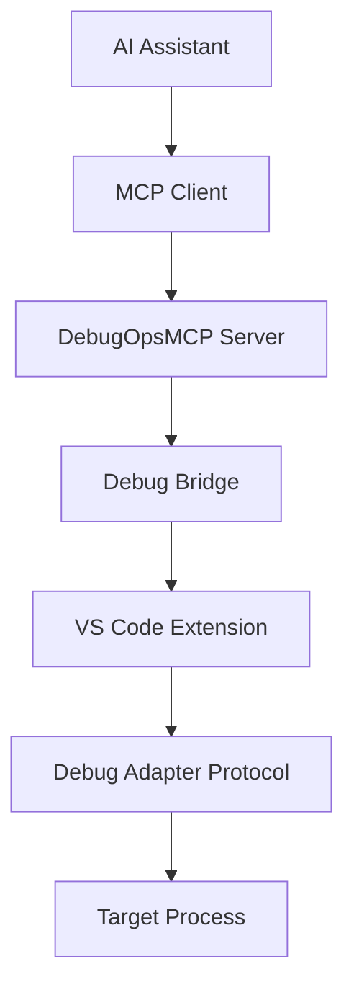

# DebugOpsMCP Protocol Documentation

## Table of Contents

1. [Overview](#overview)
2. [Architecture](#architecture)
3. [MCP Protocol Implementation](#mcp-protocol-implementation)
4. [Debug Bridge Communication](#debug-bridge-communication)
5. [API Reference](#api-reference)
6. [Extension Development](#extension-development)
7. [Error Handling](#error-handling)
8. [Examples](#examples)

## Overview

DebugOpsMCP (Debug Operations Model Context Protocol) is a specialized implementation of the Model Context Protocol (MCP) designed for debugging operations. It enables AI assistants to interact with debugging tools and inspect running processes through a standardized JSON-RPC protocol.

### Key Features

- **Extension-mediated debugging**: VS Code extension handles Debug Adapter Protocol (DAP)
- **Bidirectional communication**: Server-to-extension communication via stdio
- **Comprehensive error handling**: Custom exception types and retry mechanisms  
- **Automatic server discovery**: Multiple fallback paths for server location
- **Real-time debugging**: Breakpoint management, execution control, and inspection

## Architecture



### Components

- **MCP Server** (`DebugOpsMCP.Host`): Core server handling MCP protocol
- **Debug Bridge** (`ExtensionMediatedDebugBridge`): Communication layer with VS Code
- **VS Code Extension**: DAP integration and debugging UI
- **Debug Tools**: Specialized handlers for different debugging operations

## MCP Protocol Implementation

### Message Format

All messages follow JSON-RPC 2.0 specification:

```json
{
  "jsonrpc": "2.0",
  "id": "unique-request-id",
  "method": "method-name",
  "params": {
    // Method-specific parameters
  }
}
```

### Response Format

```json
{
  "jsonrpc": "2.0",
  "id": "request-id",
  "result": {
    "success": true,
    "data": {
      // Response data
    },
    "message": null
  }
}
```

### Error Format

JSON-RPC errors produced by the MCP host map the MCP string error codes to
numeric JSON-RPC codes when possible. The original MCP string code is preserved
in `error.data.mcpCode` so clients can reason about MCP-specific error semantics.

Example:

```json
{
  "jsonrpc": "2.0",
  "id": "request-id",
  "error": {
    "code": -32601,
    "message": "Unknown method: foo",
    "data": {
      "mcpCode": "METHOD_NOT_FOUND",
      "details": null
    }
  }
}
```

Note: For callers that do not use JSON-RPC (legacy or direct consumers of the
host API), the server will continue to return the raw MCP JSON response object
(for example `{ "success": true, "result": ... }`). JSON-RPC callers will
receive the envelope shown above (with `result` containing `{ success, data, message }`).

## Debug Bridge Communication

The Debug Bridge facilitates communication between the MCP server and VS Code extension using stdio streams.

### Message Types

1. **Request**: Server to extension command
2. **Response**: Extension response to server request  
3. **Event**: Asynchronous notifications

### Bridge Message Format

```json
{
  "id": "message-id",
  "type": "request|response|event",
  "method": "bridge-method",
  "data": {},
  "error": "error-message",
  "timestamp": "2025-08-30T07:38:51.696Z"
}
```

### Connection Management

```csharp
// Initialize bridge connection
var bridge = serviceProvider.GetService<IDebugBridge>();
var success = await bridge.InitializeAsync();

// Send debug request
var response = await bridge.SendRequestAsync<DebugAttachRequest, DebugSessionResponse>(
    new DebugAttachRequest { ProcessId = 1234 });
```

## API Reference

### Health Check

**Method**: `health`  
**Description**: Verify server status

```json
// Request
{
  "jsonrpc": "2.0",
  "id": "health-1",
  "method": "health"
}

// Response
{
  "jsonrpc": "2.0", 
  "id": "health-1",
  "result": {
    "success": true,
    "data": "DebugOpsMCP server is running"
  }
}
```

### Debug Lifecycle

#### Attach to Process

**Method**: `debug.attach`  
**Description**: Attach debugger to running process

```json
// Request
{
  "jsonrpc": "2.0",
  "id": "attach-1", 
  "method": "debug.attach",
  "params": {
    "processId": 1234,
    "configuration": {
      "stopOnEntry": false,
      "justMyCode": true
    }
  }
}

// Response
{
  "jsonrpc": "2.0",
  "id": "attach-1",
  "result": {
    "success": true,
    "data": {
      "sessionId": "session-123",
      "capabilities": {
        "supportsBreakpoints": true,
        "supportsConditionalBreakpoints": true,
        "supportsEvaluateForHovers": true
      },
      "status": "attached"
    }
  }
}
```

#### Launch Program

**Method**: `debug.launch`  
**Description**: Launch program for debugging

```json
// Request
{
  "jsonrpc": "2.0",
  "id": "launch-1",
  "method": "debug.launch", 
  "params": {
    "program": "C:\\path\\to\\app.exe",
    "args": ["--debug", "--verbose"],
    "configuration": {
      "stopOnEntry": true,
      "workingDirectory": "C:\\path"
    }
  }
}
```

### Execution Control

#### Continue Execution

**Method**: `debug.continue`  
**Description**: Continue execution from current breakpoint

```json
// Request
{
  "jsonrpc": "2.0",
  "id": "continue-1",
  "method": "debug.continue",
  "params": {
    "threadId": 12345
  }
}

// Response
{
  "jsonrpc": "2.0",
  "id": "continue-1", 
  "result": {
    "success": true,
    "data": {
      "allThreadsContinued": true
    }
  }
}
```

#### Step Operations

**Method**: `debug.step`  
**Description**: Step through code execution

```json
// Request - Step Over
{
  "jsonrpc": "2.0",
  "id": "step-1",
  "method": "debug.step",
  "params": {
    "threadId": 12345,
    "stepType": "over"
  }
}

// Request - Step Into  
{
  "jsonrpc": "2.0",
  "id": "step-2", 
  "method": "debug.step",
  "params": {
    "threadId": 12345,
    "stepType": "into"
  }
}

// Request - Step Out
{
  "jsonrpc": "2.0",
  "id": "step-3",
  "method": "debug.step", 
  "params": {
    "threadId": 12345,
    "stepType": "out"
  }
}
```

### Breakpoint Management

#### Set Breakpoint

**Method**: `debug.setBreakpoint`  
**Description**: Set breakpoint at specified location

```json
// Request
{
  "jsonrpc": "2.0",
  "id": "bp-set-1",
  "method": "debug.setBreakpoint",
  "params": {
    "file": "C:\\source\\program.cs",
    "line": 42,
    "condition": "variable > 10",
    "hitCondition": "3"
  }
}

// Response
{
  "jsonrpc": "2.0",
  "id": "bp-set-1",
  "result": {
    "success": true,
    "data": {
      "id": "bp-001",
      "file": "C:\\source\\program.cs",
      "line": 42,
      "verified": true,
      "condition": "variable > 10"
    }
  }
}
```

#### List Breakpoints

**Method**: `debug.listBreakpoints`  
**Description**: Get all active breakpoints

```json
// Request
{
  "jsonrpc": "2.0",
  "id": "bp-list-1",
  "method": "debug.listBreakpoints"
}

// Response
{
  "jsonrpc": "2.0",
  "id": "bp-list-1",
  "result": {
    "success": true,
    "data": [
      {
        "id": "bp-001",
        "file": "C:\\source\\program.cs",
        "line": 42,
        "verified": true,
        "condition": "variable > 10"
      },
      {
        "id": "bp-002", 
        "file": "C:\\source\\utils.cs",
        "line": 15,
        "verified": true
      }
    ]
  }
}
```

### Code Inspection

#### Get Stack Trace

**Method**: `debug.getStackTrace`  
**Description**: Retrieve current call stack

```json
// Request
{
  "jsonrpc": "2.0",
  "id": "stack-1",
  "method": "debug.getStackTrace",
  "params": {
    "threadId": 12345,
    "startFrame": 0,
    "levels": 20
  }
}

// Response
{
  "jsonrpc": "2.0",
  "id": "stack-1",
  "result": {
    "success": true,
    "data": {
      "frames": [
        {
          "id": "frame-1",
          "name": "Main",
          "source": {
            "name": "Program.cs",
            "path": "C:\\source\\Program.cs"
          },
          "line": 42,
          "column": 16
        },
        {
          "id": "frame-2",
          "name": "ProcessData",
          "source": {
            "name": "DataProcessor.cs", 
            "path": "C:\\source\\DataProcessor.cs"
          },
          "line": 128,
          "column": 24
        }
      ],
      "totalFrames": 2
    }
  }
}
```

#### Get Variables

**Method**: `debug.getVariables`  
**Description**: Get variables in current scope

```json
// Request
{
  "jsonrpc": "2.0",
  "id": "vars-1",
  "method": "debug.getVariables",
  "params": {
    "frameId": "frame-1",
    "filter": "locals"
  }
}

// Response
{
  "jsonrpc": "2.0",
  "id": "vars-1",
  "result": {
    "success": true,
    "data": [
      {
        "name": "variable",
        "value": "15",
        "type": "int"
      },
      {
        "name": "data",
        "value": "{ Count: 3 }",
        "type": "List<string>",
        "variablesReference": "var-ref-1"
      }
    ]
  }
}
```

#### Evaluate Expression

**Method**: `debug.evaluate`  
**Description**: Evaluate expression in debug context

```json
// Request
{
  "jsonrpc": "2.0",
  "id": "eval-1",
  "method": "debug.evaluate",
  "params": {
    "expression": "variable * 2 + data.Count",
    "frameId": "frame-1",
    "context": "watch"
  }
}

// Response
{
  "jsonrpc": "2.0",
  "id": "eval-1",
  "result": {
    "success": true,
    "data": {
      "result": "33",
      "type": "int"
    }
  }
}
```

### Thread Management

#### Get Threads

**Method**: `debug.getThreads`  
**Description**: List all threads in debug session

```json
// Request
{
  "jsonrpc": "2.0",
  "id": "threads-1", 
  "method": "debug.getThreads"
}

// Response
{
  "jsonrpc": "2.0",
  "id": "threads-1",
  "result": {
    "success": true,
    "data": [
      {
        "id": 12345,
        "name": "Main Thread",
        "status": "stopped"
      },
      {
        "id": 12346,
        "name": "Background Worker",
        "status": "running"
      }
    ]
  }
}
```

#### Get Debug Status

**Method**: `debug.getStatus`  
**Description**: Get current debug session status

```json
// Request
{
  "jsonrpc": "2.0",
  "id": "status-1",
  "method": "debug.getStatus"
}

// Response
{
  "jsonrpc": "2.0",
  "id": "status-1",
  "result": {
    "success": true,
    "data": {
      "isDebugging": true,
      "isPaused": true,
      "activeThreadId": 12345,
      "sessionId": "session-123"
    }
  }
}
```

## Extension Development

### VS Code Extension Integration

The VS Code extension (`debugOpsMcpClient.ts`) handles the bridge communication and DAP integration.

#### Key Components

1. **Server Discovery**: Automatic detection of MCP server executable
2. **Process Management**: Spawning and managing server process  
3. **Debug Session Management**: Integration with VS Code debug API
4. **Message Routing**: Bidirectional communication with server

#### Configuration

The extension can be configured via VS Code settings:

```json
{
  "debugops-mcp.serverPath": "C:\\path\\to\\DebugOpsMCP.Host.dll",
  "debugops-mcp.serverTimeout": 10000,
  "debugops-mcp.showServerOutput": false
}
```

#### Debug Session Lifecycle

```typescript
// Start debug session
async attachToProcess(processId: number): Promise<void> {
  const session = await vscode.debug.startDebugging(
    workspace, 
    {
      type: 'debugops-mcp',
      request: 'attach',
      processId: processId
    }
  );
}

// Handle debug events  
vscode.debug.onDidTerminateDebugSession((session) => {
  if (session.type === 'debugops-mcp') {
    this.cleanup();
  }
});
```

### Creating Custom Debug Tools

To create a custom debug tool, implement the `IDebugTool` interface:

```csharp
public class CustomDebugTool : IDebugTool
{
    private readonly ILogger<CustomDebugTool> _logger;
    private readonly IDebugBridge _debugBridge;

    public CustomDebugTool(
        ILogger<CustomDebugTool> logger,
        IDebugBridge debugBridge)
    {
        _logger = logger;
        _debugBridge = debugBridge;
    }

    public async Task<McpResponse> HandleAsync(McpRequest request)
    {
        // Handle custom debug operations
        return new McpResponse<string> 
        { 
            Success = true, 
            Data = "Custom operation completed" 
        };
    }

    public bool CanHandle(string method)
    {
        return method.StartsWith("debug.custom.");
    }
}
```

### Tool Registration

Register custom tools in the dependency injection container:

```csharp
services.AddScoped<IDebugTool, CustomDebugTool>();
services.AddScoped<IMcpToolRegistry, McpToolRegistry>();
```

## Error Handling

### Exception Hierarchy

```csharp
DebugException (base)
├── DebugBridgeConnectionException
├── DebugAttachmentException  
├── DebugLaunchException
├── DebugTimeoutException
├── DebugProtocolException
├── DebugSessionConflictException
├── DebugSessionNotFoundException
├── DebugBreakpointException
├── DebugEvaluationException
└── DebugThreadException
```

### Error Response Format

```json
{
  "jsonrpc": "2.0",
  "id": "request-id",
  "error": {
    "code": "DEBUG_ATTACHMENT_FAILED",
    "message": "Failed to attach to process 1234: Access denied",
    "data": {
      "processId": 1234,
      "processName": "target.exe",
      "sessionId": "session-123"
    }
  }
}
```

### Common Error Codes

- `METHOD_NOT_FOUND`: Unknown method requested
- `INVALID_REQUEST`: Malformed request  
- `DEBUG_BRIDGE_CONNECTION_FAILED`: Cannot connect to VS Code extension
- `DEBUG_ATTACHMENT_FAILED`: Cannot attach to target process
- `DEBUG_TIMEOUT`: Operation timed out
- `DEBUG_SESSION_NOT_FOUND`: Debug session not active
- `BREAKPOINT_SET_FAILED`: Cannot set breakpoint
- `EVALUATION_FAILED`: Expression evaluation failed

### Retry Logic

The Debug Bridge implements automatic retry with exponential backoff:

```csharp
const int maxRetries = 3;
const int retryDelayMs = 1000;

for (int attempt = 1; attempt <= maxRetries; attempt++)
{
    try
    {
        return await operation();
    }
    catch (Exception ex) when (attempt < maxRetries)
    {
        await Task.Delay(retryDelayMs * attempt);
    }
}
```

## Examples

### Complete Debugging Session

```json
// 1. Attach to process
{
  "jsonrpc": "2.0",
  "id": "1",
  "method": "debug.attach",
  "params": { "processId": 1234 }
}

// 2. Set breakpoint
{
  "jsonrpc": "2.0", 
  "id": "2",
  "method": "debug.setBreakpoint",
  "params": {
    "file": "C:\\app\\main.cs",
    "line": 50
  }
}

// 3. Continue execution (hits breakpoint)
{
  "jsonrpc": "2.0",
  "id": "3", 
  "method": "debug.continue"
}

// 4. Get stack trace
{
  "jsonrpc": "2.0",
  "id": "4",
  "method": "debug.getStackTrace",
  "params": { "threadId": 12345 }
}

// 5. Get variables
{
  "jsonrpc": "2.0",
  "id": "5",
  "method": "debug.getVariables", 
  "params": { "frameId": "frame-1" }
}

// 6. Evaluate expression
{
  "jsonrpc": "2.0",
  "id": "6",
  "method": "debug.evaluate",
  "params": {
    "expression": "myVariable.ToString()",
    "frameId": "frame-1"
  }
}

// 7. Step over
{
  "jsonrpc": "2.0",
  "id": "7", 
  "method": "debug.step",
  "params": {
    "threadId": 12345,
    "stepType": "over"
  }
}
```

### AI Assistant Integration

Example of how an AI assistant might use the protocol:

```python
import json
import subprocess

class DebugOpsMCPClient:
    def __init__(self, server_path):
        self.server = subprocess.Popen(
            [server_path],
            stdin=subprocess.PIPE,
            stdout=subprocess.PIPE,
            text=True
        )
    
    def send_request(self, method, params=None):
        request = {
            "jsonrpc": "2.0",
            "id": f"req-{id(self)}",
            "method": method,
            "params": params or {}
        }
        
        self.server.stdin.write(json.dumps(request) + "\n")
        self.server.stdin.flush()
        
        response = json.loads(self.server.stdout.readline())
        return response
    
    def debug_process(self, process_id):
        # Attach to process
        response = self.send_request("debug.attach", 
                                   {"processId": process_id})
        
        if response.get("result", {}).get("success"):
            print(f"Successfully attached to process {process_id}")
            
            # Set breakpoint
            bp_response = self.send_request("debug.setBreakpoint", {
                "file": "C:\\app\\main.cs",
                "line": 42
            })
            
            if bp_response.get("result", {}).get("success"):
                print("Breakpoint set successfully")
                
                # Continue execution
                continue_response = self.send_request("debug.continue")
                print("Execution continued")

# Usage
client = DebugOpsMCPClient("DebugOpsMCP.Host.dll")
client.debug_process(1234)
```

This comprehensive documentation provides everything needed to understand, implement, and extend the DebugOpsMCP protocol.